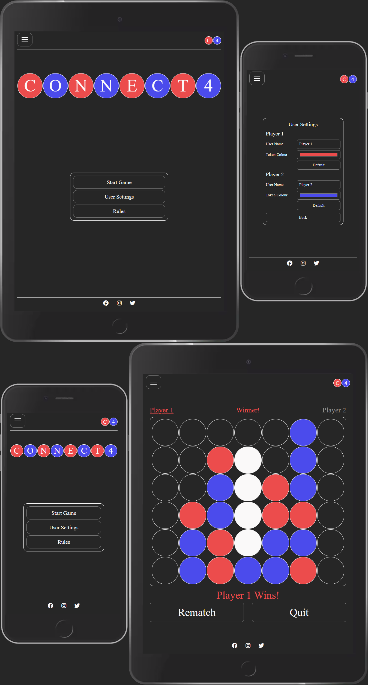
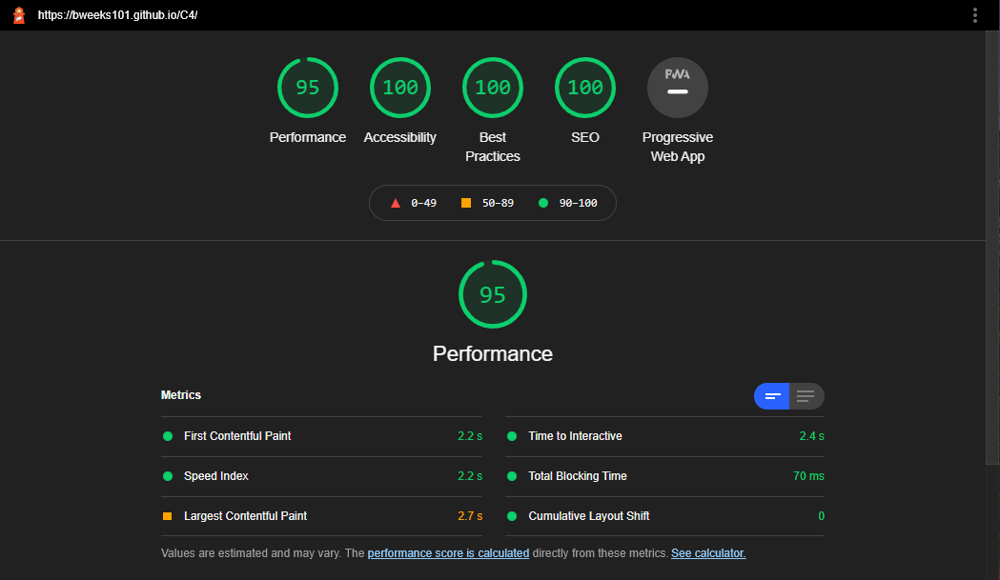
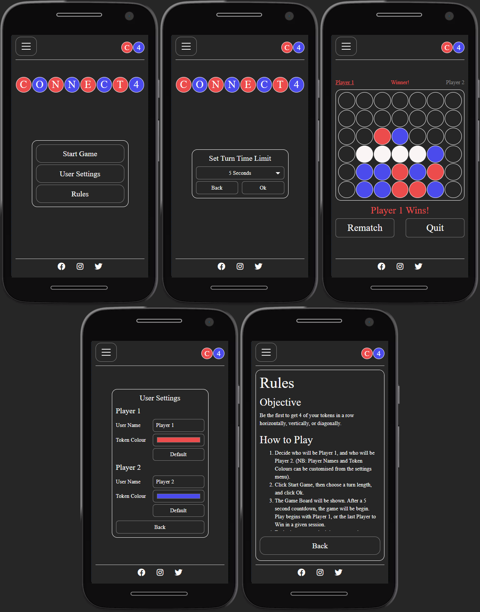

# C4

### Interactive Front-End Development Milestone Project

C4 is a JavaScript version of the classic 'Connect 4' board game, from Hasbro.

Unlike the traditional game, C4's twist limits each players turn to 5s by default (this can be adjusted up to 30s if the player is finding things too challenging).

### View the live site [here](https://bweeks101.github.io/C4/).

---
# Table of Contents
- [UX](#ux)
	- [Website Owner Goals](#website-owner-goals)
	- [User Goals](#user-goals)
		- [New User Goals](#new-user-goals)
		- [Returning User Goals](#returning-user-goals)
	- [User Stories](#user-stories)
		- [As a Site Owner](#as-a-site-owner)
		- [As a New User](#as-a-new-user)
		- [As a Returning User](#as-a-returning-user)
	- [Wireframes](#wireframes)
		- [Differences between the Wireframes and final design](#differences-between-the-wireframes-and-final-design)
	- [Surface](#surface)
		- [Colours](#colours)
		- [Fonts](#fonts)
		- [Images](#images)
- [Features](#features)
	- [Desired Features based on User Stories](#desired-features-based-on-user-stories)
	- [Existing Features](#existing-features)
	- [Features Left to Implement](#features-left-to-implement)
	- [Outstanding Issues](#outstanding-issues)
- [Technologies Used](#technologies-used)
- [Testing](#testing)
	- [Performance Testing](#performance-testing)
	- [Functionality Testing](#functionality-testing)
- [Notable Challenges](#notable-challenges)
	- [datagrid.js](#datagrid.js)
	- [jQuery](#jquery)
	- [JavaScript animations and dynamic scaling](#javascript-animations-and-dynamic-scaling)
- [Deployment](#deployment)
- [Credits](#credits)
	- [Content](#content)
	- [Acknowledgements](#acknowledgements)
	- [Research](#research)
- [Screenshots](#screenshots)
___
# UX

C4, (based on the classic 'Connect 4' game from Hasbro), is quick and easy to play, yet difficult to master. Using the default setting of 5s per player turn, a single game will be completed in under 4 minutes. This makes it ideal for play with a friend during short work/education breaks, or whilst waiting for the kettle to boil!

C4 has a light, minimalist design - it is a single responsive page with no images beyond the favicon and social media icons. The site is functional on desktops, laptops and mobile devices, with a minimum supported horizontal resolution of 280px, and minimum supported vertical resolution of 568px.

*NB: The site will function on lower horizontal/vertical resolutions, but the page will scroll as required.  This may interfere with gameplay.*

## Website Owner Goals
My wife regularly beats me at Connect 4, so I wanted a way to practice and improve, whilst also having a quicker method of play than having to dig through our cupboard for the box!  The board game is very simple, and I wanted the site to reflect this.  It needed to be small and lightweight with no unnecessary images and minimal requirements for additional frameworks.  It also needed a unique hook which would encourage players to improve, and a time limit on player turns seemed like a simple solution to this.  The site needed to be be functional on multiple device types and resolutions, and regardless of device type players should be able to get into a game with minimal user interface interaction.

## User Goals

#### New User Goals:
1. User is able to play C4 with a real opponent in local hotseat or online multiplayer.
2. User can alter time limits for each player turn.
3. User is able to play C4 against an AI opponent .
4. User can alter the difficulty of the AI to adjust the challenge.
5. User can customise and save their profile and preferences.
6. User is able to access the rules for the game.
7. User is able to load the site quickly and begin a game with minimal interaction (less than 3 clicks).
8. User is able to play the game on mobile devices, tablets, laptops and desktops.

#### Returning User Goals:
1. User preferences are restored automatically.
2. User can review their results and compare with other players.

## User Stories

#### As a Site Owner:
1. I want users to be able to quickly access the site - it must be small and lightweight.
2. I want users to be able to store their preferences.
3. I need users to be able to play together in multiplayer.
4. I need to users to able to adjust game difficulty to meet their challenge requirements.
5. I would like users to be able to get into a game with a minimal amount of interaction (less than 3 clicks).

#### As a New User:
1. I would like to be able to play a version of Connect 4 in a browser in local hotseat and online multiplayer.
2. I want to be able to alter the time limit for each player turn to adjust the challenge in multiplayer.
3. I would like to be able to play a version of Connect 4 in a browser against an AI opponent.
4. I need like to be able to alter the difficulty of the AI to adjust the challenge as I improve at the game.
5. I wish to be able to customise my profile and playing pieces so that my experience is more unique.
6. I need to be able to get into a game quickly and easily.
7. I need to be able to review the rules for the game so that I can learn how to play.
8. I wish to be able to play the game on multiple device types.

#### As a Returning User:
1. I need my preferences to be saved so that I do not have to spend time reconfiguring them each time I visit the site.
2. I would like to be able to review my results vs those of other players so that I can monitor my performance.

## Wireframes

Wireframes created in [Balsamiq](https://balsamiq.com/wireframes/), and exported to [/wireframes/c4-wireframes.pdf](wireframes/c4-wireframes.pdf)

### Differences between the Wireframes and final design

Whilst the site follows the same basic structure as the design wireframes, significant compromises had to be made due to time restrictions and technology availability. The site currently features a main page, where the user can see an animated logo, review the rules, customise player names and token colours, or start a local 'hotseat' multiplayer game. The side navigation menu also features the option to switch between light and dark modes (with dark being the default).  The player can also specify the turn time length for games.  These preferences are all written to local storage and restored automatically when the page loads.

It was not possible to implement online multiplayer, leaderboards/stat tracking, player accounts, or the uploading of profile images without a more comprehensive backend and database structure that are currently unavailable. A single player AI was desired, but unfortunately was not achievable within the given timeframe.

# Surface
## Colours
Dark Theme primary colours:
* Background:  #262626
* Fonts and links:  #fafafa
* Hover:  #ec4c4c

Light Theme primary colours:
* Background:  #f7f9fa
* Fonts and links:  #262626
* Hover:  #4B4BEC

## Fonts
I used Serif throughout the site.

## Images
 * Favicon created by myself using [GIMP](https://www.gimp.org/)
 * SVG Masks utilised on the Nav button served by the [W3 SVG XML Namespace](http://www.w3.org/2000/svg)
	 * SVG Mask URLs for both Dark and Light themes were copied from the [Bootstrap](https://getbootstrap.com) '.navbar-dark .navbar-toggler-icon' style rule, and modified.
 * Social media icons served by [Font Awesome](https://fontawesome.com/)

[Back to Table of contents](#table-of-contents)
___
# Features
The website consists of a single page with content manipulated by JavaScript.  Content is navigable via on screen menu options as well as a side navigation menu accessed via a burger button on the page header.  The header also features a site logo which can be clicked to reload the page.  The site footer contains social media links.

## Desired Features based on User Stories

1. The site must be small and lightweight.  It should avoid excessive use of images and external frameworks to keep data requirements low and performance high.
2.  Fully responsive mobile first design allows for a functional site on mobile, tablet, laptop and desktop, with a minimum. resolution of 280px x 568px.
3. User preferences should allow uploading of profile pictures, username customisation and colour selection for player tokens. 
4. User preferences should be stored and automatically loaded in future sessions without additional interaction.
5. Local hotseat multiplayer to facilitate play on a single device.
6. Online multiplayer
7. User selected turn time limits allow players to decrease/increase the pressure in line with their own skill level/preferences.
8. Functional single player UI with multiple difficulty levels allowing for a solo experience.
9. Users should be able to start a game quickly with minimal interaction (less than 3 clicks).
10. Rules available to read online for players unfamiliar with the game.
11. User stat tracking allows users to monitor their progress, and find opponents of a similar skill level.10. 
12. Leaderboards!

## Existing Features

1. The site must be small and lightweight.  It should avoid excessive use of images and external frameworks to keep data requirements low and performance high.
	>The site features a single page, with content manipulated via JavaScript.  The only images are the favicon and 3 social media icons (hosted by Font Awesome).  Bootstrap is utilised via bootstrap-min to reduce the footprint.

2. Fully responsive mobile first design allows for a functional site on mobile, tablet, laptop and desktop, with a minimum width of 280px, and minimum height of 568px.
	>The site was designed mobile-first, and dynamically scales up to higher resolutions. The game renders and plays perfectly on modern mobile devices, which is the ideal way to play.

3. User preferences should allow uploading of profile pictures, username customisation and colour selection for player tokens. 
	>Due to technological limitations it was not possible to create a full user profile based experience.  However users can alter usernames and colour selection for both players, and these values are written to local storage.  The chosen colour mode for the site  - Dark (default) or Light is also stored, along with the selected Turn Time Limit.

4. User preferences should be stored and automatically loaded in future sessions without additional interaction.
	>Stored preferences (Usernames, colours, turn time limit, and colour mode) are applied automatically when the site loads.

5. Local hotseat multiplayer to facilitate play on a single device.
	>1. This feature is fully functional. In just 2 clicks, players can be in game.
	>2. A game can be paused/resumed/reset at any time.
	>3. If left to run without user interaction, each time a player fails to take an action during their turn, the game will automatically insert a token for that player into a random column.
	>4. Once a win/draw has been determined, a rematch can be started (using the same turn time limit) directly from the game screen.

6. User selected turn time limits allow players to decrease/increase the pressure in line with their own skill level/preferences.
	>Time limits can be set in increments of 5 seconds, starting with the default of 5 to a maximum of 30.

7. Users should be able to start a game quickly with minimal interaction (less than 3 clicks).
	>Using the default settings, a player can get into a game with just 2 clicks ('Start Game'->'Ok').

8. Rules available to read online for players unfamiliar with the game.
	>The rules are available to read from the side menu, or directly from the main page.

## Features Left to Implement

1. Rules display during game play
	>I would like to add a feature to display the rules in a pop-up whilst the game is paused. Currently the rules are not accessible during game play.

2. Single Player AI
	>I would like to add a single player AI. Unfortunately this moved out of scope due to time constraints.

3. Online Multiplayer, Leaderboards/Stat Tracking
	>I would like to add Online Multiplayer, with Leaderboards and player stat tracking. This will require a more comprehensive backend with database functionality that was not available for this project.

4. User Accounts with personalised settings (such as uploading profile pictures)
	>I would like to add a User Account system. This will assist with Leaderboards/Stat Tracking, and will also allow players to save their name/colours and a profile picture for use on multiple devices/browsers. This would also require a backend database.

## Outstanding Issues

1. When viewing the site through browser dev tools, changing the device or directly altering the device resolution can lead to rendering inconsistencies.
	>My previous project made extensive use of media queries. For this project I wanted to heavily focus on JavaScript, so instead of media queries I have made use of the onresize attribute. Changing the device or directly altering the resolution values within dev tools does not seem to consistently trigger onresize.  Any rendering inconsistencies can be resolved by refreshing the page, or manually resizing the device display to trigger the onresize function.

2. When resizing the site whilst the logo animation plays, elements on the page will not resize until the animation is complete.
	>When the animation completes, elements will automatically resize correctly.  With more time I would look to implement functionality into the animation to pause it during resize, then restart when the resize is complete.

[Back to Table of contents](#table-of-contents)
___
# Technologies Used

* [HTML5](https://en.wikipedia.org/wiki/HTML5/)
	-	HTML was validated using [validator.w3.org](https://validator.w3.org/nu/)
* [CSS3](https://en.wikipedia.org/wiki/Cascading_Style_Sheets/)
	- CSS was validated using [jigsaw.w3.org](https://jigsaw.w3.org/css-validator/)
* [JavaScript](https://javascript.com)
	- JavaScript was linted with [JSHint](https://jshint.com/) and [JSLint](https://jslint.com/)
* [Bootstrap](https://getbootstrap.com)
	- The project uses **Bootstrap** to simplify flex layout, and assist with DOM manipulation via useful pre-built classes.
* [Font Awesome](https://fontawesome.com/)
	- The project uses **Font Awesome** for social media icons.
* [Git](https://git-scm.com/)
	- **Git** was used for version control
* [GitHub](https://github.com)
	- I used the [Code Institute template](https://github.com/Code-Institute-Org/gitpod-full-template) to create a **GitHub** repo, and use **GitHub Pages** to host the site.
* [Gitpod](https://gitpod.io)
	- The project was written in **Gitpod**, again making use of the [Code Institute template](https://github.com/Code-Institute-Org/gitpod-full-template)
* [StackEdit](https://stackedit.io/)
	- I used **StackEdit** to assist in writing this Readme.
* [Mermaid.js Live Editor](https://mermaid-js.github.io/mermaid-live-editor/)
	- I used the **Mermaid.js** Live Editor to create the flowcharts used for testing.
		- As the Live Editor produced an error when converting some of my charts to images, I used the 'Link to View' option and printed the charts directly to PDF.
* [GNU Image Manipulation Program (GIMP)](https://www.gimp.org/)
	- Used to create images for this readme.

[Back to Table of contents](#table-of-contents)
___
# Testing

All testing was conducted manually, making extensive use of Dev Tools within Mozilla Firefox, Google Chrome and Microsoft Edge.

## Performance Testing
I used [Lighthouse](https://developers.google.com/web/tools/lighthouse/) within Google Chrome Dev Tools for performance testing.  Although variation should be expected, the results below were consistently achieved.

Desktop Results

Mobile Results
 

## Functionality Testing
Devices tested in browser dev tools include:
>Galaxy Fold
>iPhone 5/SE
>Pixel 2
>Galaxy S5
>Moto G4
>iPhone 6/7/8
>Surface Duo
>iPhone 6/7/8 Plus
>Galaxy S9/S9+/S10e
>iPhone X/XS
>Pixel 2 XL
>720p Screens
>1080p Screens
>4k Screens

Devices physically tested include:
>Galaxy S8
>Galaxy S10/S10e
>Galaxy A21
>Galaxy Tab A 10.1 2019
>1080p Screens
>4k Screens

The minimum supported width is 280px, and the minimum supported height is 568px.
Testing was performed using the following flowcharts:

1. Logo Animation
	[logo-animation.pdf](wireframes/c4-logo-animation.pdf)

2. Rules
	[rules.pdf](wireframes/c4-rules.pdf)

3. User Settings
	[user-settings.pdf](wireframes/c4-user-settings.pdf)
	[user-settings-validation-alert.pdf](wireframes/c4-user-settings-validation-alert.pdf)
	
4. Side Navigation Menu:
	[sidenav.pdf](wireframes/c4-sidenav.pdf)

5. Start a Game
	[start-game.pdf](wireframes/c4-start-game.pdf)
	
[Back to Table of contents](#table-of-contents)
___
# Notable Challenges

## datagrid.js

The original UX design of the site necessitated multiple user selectable datagrids. The original concept involved pulling data from databases into objects, which would display as a fairly traditional datagrid, with fixed headers, content scroll and options to select entire columns or rows with a single click. eg:

- The leaderboard display had multiple column headings, and then users with their win/loss record
- Joining a multiplayer game would require selecting an open slot from a list of available games, displayed as a list
- The game board itself would be a datagrid without headers

However, neither HTML nor JavaScript have a default datagrid control. This meant that I would either have to:

- Build a custom layout for each grid by hand, and then very carefully programmatically populate and refresh the date,
- Look for a control that had already been created, learn how to use it, avoid any pitfalls (and potentially any bloat) that could be caused by another framework.
- Write my own

I decided to go with the latter option. It was a challenge, but had the advantages of getting me familiar with manipulating the DOM, and creating and utilising objects and object constructors. I approached this as if I was creating a framework that could be used for multiple projects, so datagrid.js has standardised functions and objects, a default matching CSS (datagrid.css), and plenty of comments!

The datagrid object consists of a single array for the header row (the headerArray) of which each element must be a string, then another array for each column of data (contentArrays). Their must be one content array per element within the header array. Content arrays do not all need to contain the same number of objects - undefined entries will be pushed to the end of each array shorter than the longest to pad the length.  

The dataGridDisplay function will then render this data (with multiple options available) as a flex grid built (for now) using bootstrap.

Please see the comments within datagrid.js and datagrid.css for more details (including limitations).  

In the future I would like to resolve the noted limitations (max of 12 columns within a screen, only vertical scroll with locked headers) and remove the reliance on bootstrap by creating dedicated style rules and making use of TD and TR elements (avoiding bootstraps documented recommendation of a div container to hold div rows which hold div columns).

##  jQuery

As I had never worked with JavaScript before, I wanted to become as familiar with it as possible. Therefore I made the decision to avoid using jQuery for this project, with the exception of a single $(document).ready() call (jquery min was already utilised by Bootstrap, so no additional scripts were required for this).   I wanted to become familiar with native JavaScript before I started making use of custom solutions and shortcuts.

## JavaScript animations and dynamic scaling

Although I wanted to keep the site as lean as possible with very few images and no media-queries, the design still required a logo and small navbar logo. I decided to make further use of my datagrid for both, and learn how to animate with JavaScript at the same time. This also provided an opportunity to learn how to dynamically scale text on resize relative to other dynamically resized elements.

The site is supported on devices with a minimum width of 280px (based on the Galaxy Fold in dev tools), and a minimum height of 568px (based on the iPhone5 in dev tools). Dynamic scaling is achieved by utilising JavaScript functions attached to the onresize attribute of the body element.

[Back to Table of contents](#table-of-contents)
___
# Deployment

The project was deployed to GitHub Pages using the following method:

1. Open the [Code Institute Gitpod Template](https://github.com/Code-Institute-Org/gitpod-full-template/)
2. Click [Use this template](https://github.com/Code-Institute-Org/gitpod-full-template/generate/)
3. Provide a Name
4. Provide a Description
5. Choose Public
6. Click 'Create Repository from template'. GitHub will create the repository and open it.
7. Click 'Settings'
8. Scroll down to 'GitHub Pages'
9. Change Source from 'none' to 'master' and click 'Save'

The project was then developed using [Gitpod](https://gitpod.io/). There are no differences between the developed and deployed versions, and no additional code branches. Changes saved in Gitpod were committed and pushed to GitHub frequently throughout the development process.

Running the code locally would involve installing a webhost, downloading the latest [commit](https://github.com/BWeeks101/C4/archive/master.zip), then extracting that zip to an appropriate folder to be hosted by the local webhost.

There are far too many potential applications and configurations to list them here in detail. The site contains HTML, CSS, and JavaScript so should not be complex to host, however I would recommend sticking to the hosted site on [GitHub Pages](https://bweeks101.github.io/C4/).

[Back to Table of contents](#table-of-contents)
___
# Credits

* Connect 4 board game from [Hasbro](https://products.hasbro.com/en-gb/product/connect-4-game:80FB5BCA-5056-9047-F5F4-5EB5DF88DAF4)
* Code Institute [Gitpod Template](https://github.com/Code-Institute-Org/gitpod-full-template)
* Flex based 'Sticky Footer from [CSS-Tricks](https://css-tricks.com/couple-takes-sticky-footer/) and [Philip Walton](https://philipwalton.github.io/solved-by-flexbox/demos/sticky-footer/)
* SideNav from [W3 Schools Example](https://www.w3schools.com/howto/howto_js_sidenav.asp)
* Customised Select Control from [W3 Schools Example](https://www.w3schools.com/howto/howto_custom_select.asp)
* Animation Function Structure from [W3 Schools Example](https://www.w3schools.com/howto/howto_js_animate.asp)
* Change colour of svg on hover (mask method) from [CSS-Tricks.com](https://css-tricks.com/change-color-of-svg-on-hover/#use-a-mask-instead-of-a-background-image)
* SVG Mask URLs for both Dark and Light themes were copied from the [Bootstrap](https://getbootstrap.com) '.navbar-dark .navbar-toggler-icon' style rule, and modified.
* '.c4-button-large' style rule copied from [Bootstrap](https://getbootstrap.com) '.btn-lg' style rule and modified.
* I utilised a workaround proposed by [Alec Rust](https://stackoverflow.com/users/312681/alecrust) on [Stack Overflow](https://stackoverflow.com/) to [add colour samples](https://stackoverflow.com/questions/11509830/how-to-add-color-to-githubs-readme-md-file/41247934#41247934)  to the [Surface](#surface) section of this readme.

## Content

All text content written by myself.  

## Acknowledgements

I received inspiration for this project from my mentor, Adegbenga Adeye (@gbenga_mentor on slack), and the Hasbro board game 'Connect 4'.

## Research:

* CI Course Material and example projects
* W3C Schools [CSS](https://www.w3schools.com/css/default.asp/), [HTML](https://www.w3schools.com/html/default.asp/) and [JavaScript](https://www.w3schools.com/js/DEFAULT.asp) Documentation
*  [Bootstrap](https://getbootstrap.com/docs/4.5/getting-started/introduction/) Documentation
* MDN web docs ([JavaScript](https://developer.mozilla.org/en-US/docs/Web/javascript), [CSS](https://developer.mozilla.org/en-US/docs/Web/CSS/), [HTML](https://developer.mozilla.org/en-US/docs/Web/HTML/))
*  [Adobe Colour Wheel](https://color.adobe.com/create/color-wheel/)
*  [ColorHexa.com](https://www.colorhexa.com/)
*  [Coolors.co](https://coolors.co/)
*  [CSS-Tricks.com](https://css-tricks.com/)
*  [Stack Overflow](https://stackoverflow.com/)*

*It is almost impossible to search for any coding related issue online without encountering Stack Overflow links towards the top of the results. Whilst I certainly read Stack Overflow when researching solutions to challenges, I have not (to the best of my recollection or per my notes) utilised any code directly, in whole or in part, (with the exception of the workaround for this readme listed in the [credits](#credits) above).

[Back to Table of contents](#table-of-contents)
___
# Screenshots
